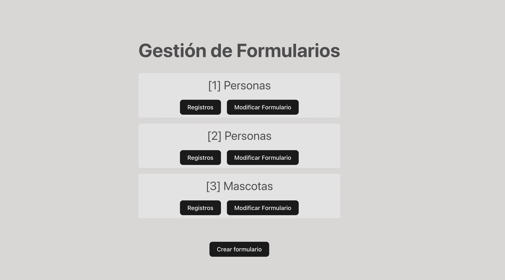
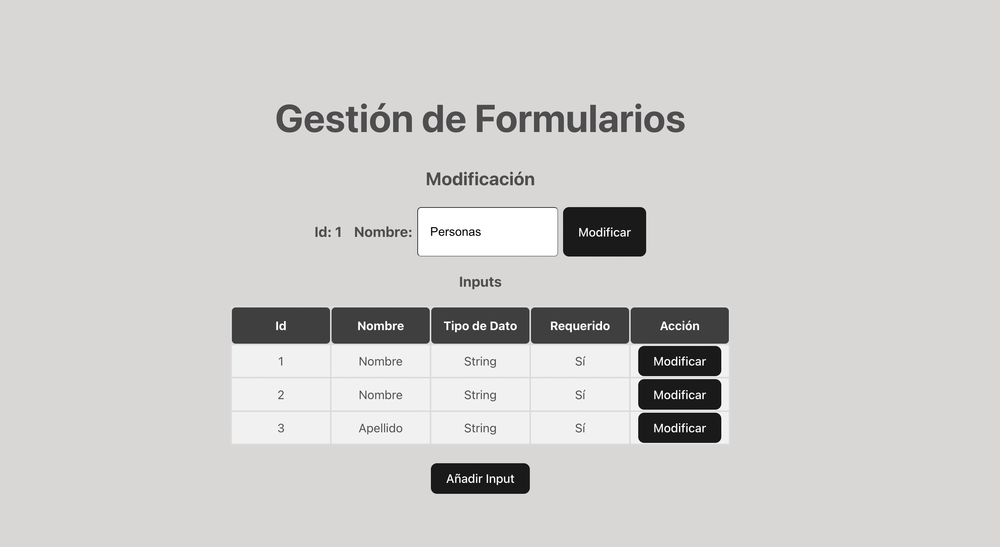
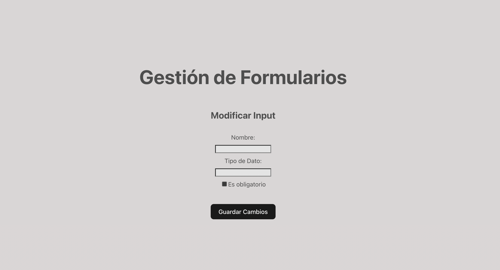

# Prueba .NET + ReactJS
## Descripción
Proyecto creado para la gestión de formularios, lo cual incluye para este alcance: 
* Visualización de formularios

Y además, se puede consultar y modificar registros para cada formulario. 

El Frontend está desarrollado en Javascript, con ReactJS.
El Backend está desarrollado en C#, con .NET y base de datos MySQL.
El Backend se lo puede desplegar a través de Docker.

## Pasos para ejecutar el proyecto localmente
### Requisitos
- Tener instalado npm, Docker, Docker Compose, dotnet
- En caso de faltar dependencias, estas se encuentras descritas en el archivo de configuración (en el baso del backend)
### Frontend
- Ir a la carpeta del frontend, y ejecutar el comando npm install
### Backend
- Para .NET, se redirige a backend/API y se ejecuta el comando dotnet run o dotnet watch
- Para la base de datos, se tiene que estar al mismo nivel que el archivo docker-composer.yml y se lo ejecuta con el siguiente comando:
  docker-compose up -d

## Evidencias
### Captura con el listado de formularios y botones con el nombre del formulario

### Captura para la edición de formularios

### Captura para la edición de inputs (campos) de un formulario

